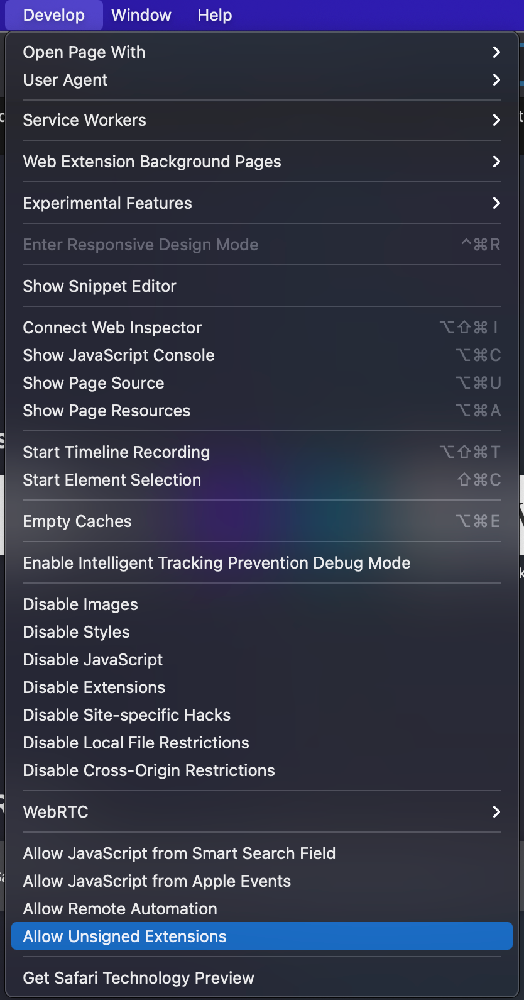
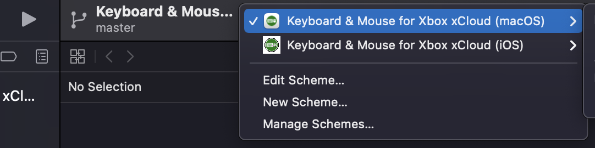
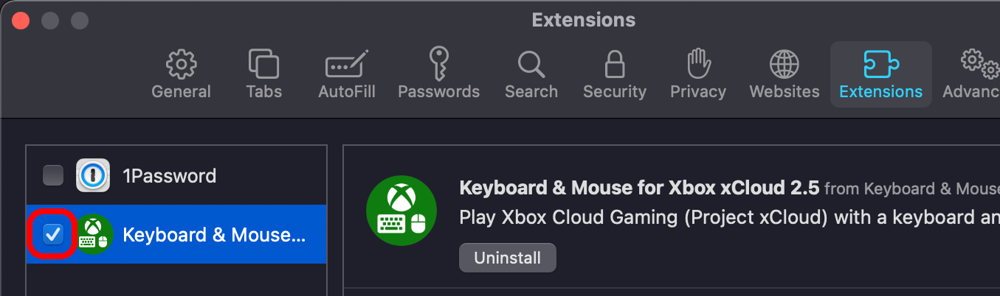
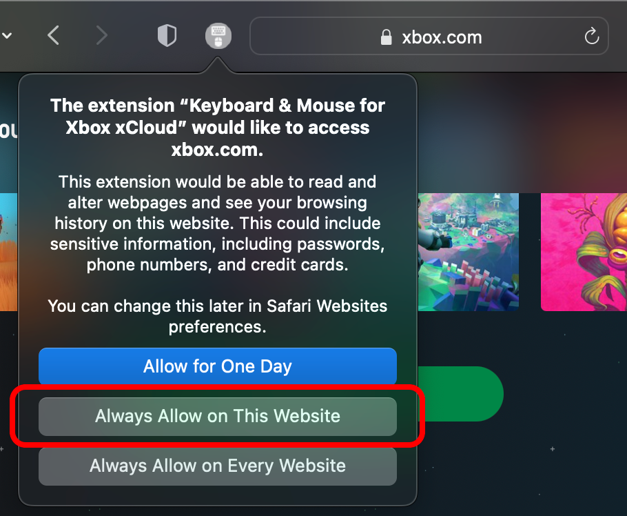

## How to Build/Run on Safari

These instructions are for **local development** of the Safari extension.

### Setup

1. Install [Xcode](https://apps.apple.com/us/app/xcode/id497799835)
1. Install [Node.js](https://nodejs.org/en/download/)
1. [Clone this repo](https://docs.github.com/en/repositories/creating-and-managing-repositories/cloning-a-repository) locally to your computer
1. Open the folder where you cloned the repo in Terminal (e.g. `cd ~/GitHub/xcloud-keyboard-mouse`)
1. Install dependencies with `npm install`
1. Build the extension with `npm run build:safari` (or `npm run watch:safari` if you want to reload as you make changes to the code)
1. Open Safari and enable the **"Allow Unsigned Extensions"** option from the **Develop** menu. You will first have to enable the Develop menu in Safari by checking the option in **Safari > Preferences > Advanced**. [See Apple's instructions here](https://developer.apple.com/documentation/safariservices/safari_web_extensions/running_your_safari_web_extension#3744467). 
1. Open the Xcode project with `open safari/Keyboard\ \&\ Mouse\ for\ Xbox\ xCloud/Keyboard\ \&\ Mouse\ for\ Xbox\ xCloud.xcodeproj/`, or double click the `.xcodeproj` file via Finder, or via **File > Open** in Xcode
1. Select the macOS app in the Scheme menu and click the **Run** button (looks like a play button) in the Xcode menu to run the app. [See Apple's instructions here](https://developer.apple.com/documentation/safariservices/safari_web_extensions/running_your_safari_web_extension#3744471). 
1. Once the app has been run one time you can quit it - the extension should be installed! You can then enable it in **Safari > Preferences > Extensions**. 
1. Go to https://xbox.com/play and enable the extension to run on that page by clicking the new extension icon in the Safari toolbar, sellecting "Always Allow on This Website", and refreshing the page. 
